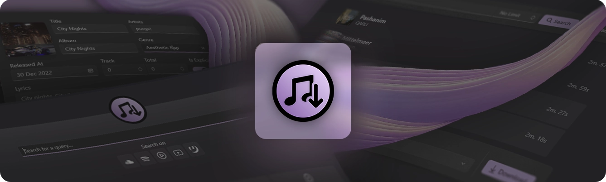
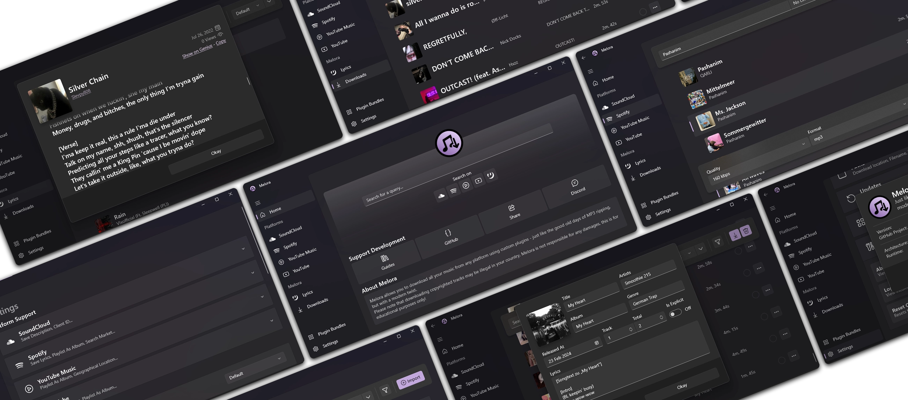



  

<h1 align="center">
  Melora
</h1>

  

<table>
  <tr>
    <td width="99999" align="center">Melora allows you to download all your music from any platform using custom plugins - just like the good old days of MP3 ripping, but with a modern twist.</td>
  </tr>
</table>

<h3 align="center">
  
   ˙ 
  
   ˙ 
  
   ˙ 
  
</h3>

---

<h3 align="center">
  About Melora
</h3>

Melora is an open-source standalone Music-Downloader designed with a focus on **simplicity**, **expandability** and **customization**. It seamlessly supports a wide range of platforms through custom plugins, ensuring that you can download your favorite tracks with no stress.

Built on **.NET 8.0** and the native **Windows App SDK**, Melora offers a sleek and intuitive user interface inspired by Microsoft's Fluent Design principles. This not only guarantees a visually pleasing experience but also delivers top-tier performance and stability.

Rediscover the joy of taking control of your favorite music — *just like in the good old days of MP3 ripping* — with Melora!

<h3 align="center">
  How it works
</h3>

Melora serves as the frontend for a variety of supported plugins, making it highly expandable and adaptable to your needs. Simply open the **Plugin Bundles** page and import your preferred plugins to enhance your experience.

Currently, **Platform-Support** Plugins ensure compatibility with all your favorite platforms, while **Metadata** Plugins give you the freedom to customize how metadata — *such as titles, artists, lyrics, and everything else* — is written to your tracks.

Looking ahead, Melora plans to support even more types of plugins, including those for syncing with other libraries like iTunes and more.

---

  

<table>
  <tr>
    <td align="center">
      <strong >Multi-Platform Support</strong>
       
      Download music from various platforms effortlessly
    </td>
    <td align="center">
      <strong>Customizable Metadata</strong>
       
      Decide what metadata you want on your tracks and what not
    </td>
    <td align="center">
      <strong>User-Friendly Interface</strong>
       
      A sleek and intuitive interface to manage your downloads
    </td>
  </tr>
</table>
